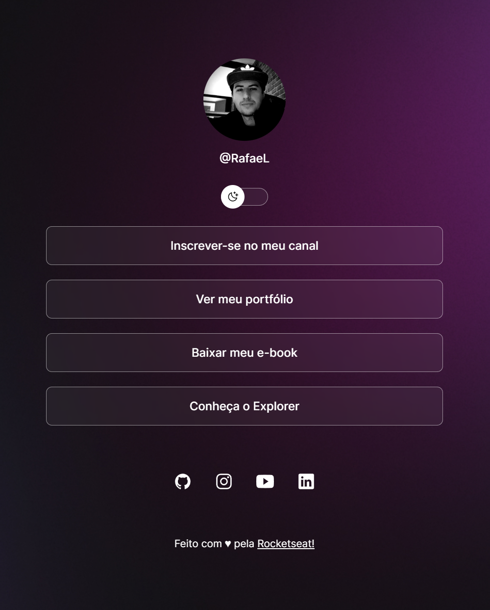

<h1 align="center">DevLinks</h1>

  

Curso exclusivo e gratuito, promovido pela Rocketseat para ensino de tecnologias WEB.

  <a href="#-tecnologias">Tecnologias</a>&nbsp;&nbsp;&nbsp;|&nbsp;&nbsp;&nbsp;
  <a href="#https://rafael-malaquias.github.io/Projeto-Discover/">Projeto</a>&nbsp;&nbsp;&nbsp;|&nbsp;&nbsp;&nbsp;
  <a href="#-layout">Layout</a>&nbsp;&nbsp;&nbsp;|&nbsp;&nbsp;&nbsp;
  <a href="#memo-licença">Licença</a>

  

 

## 🚀 Tecnologias

Esse projeto foi desenvolvido com as seguintes tecnologias:

- HTML e CSS
- JavaScript
- Git e Github
- Figma

## 💻 Projeto

O DevLinks é um agregador de links para usar como cartão de visitas online.

[Link](https://rafael-malaquias.github.io/Projeto-Discover/) - Para visualizar o projeto.

## 🔖 Layout

Você pode visualizar o layout do projeto através [DESSE LINK](https://www.figma.com/file/aZSjJQwha0awnzkn6Q9CPX/DevLinks-%E2%80%A2-Projeto-Discover-(Community)?type=design&node-id=10-620&mode=dev). É necessário ter conta no [Figma](https://figma.com) para acessá-lo.

##  📝 Licença

Esse projeto está sob a licença MIT.

---